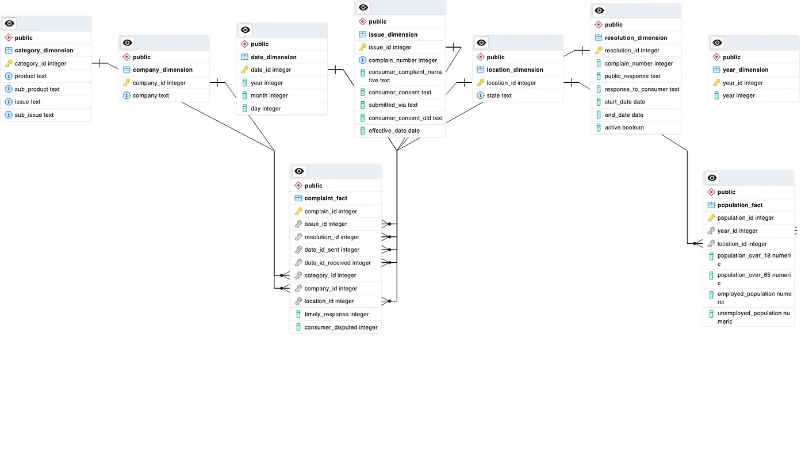
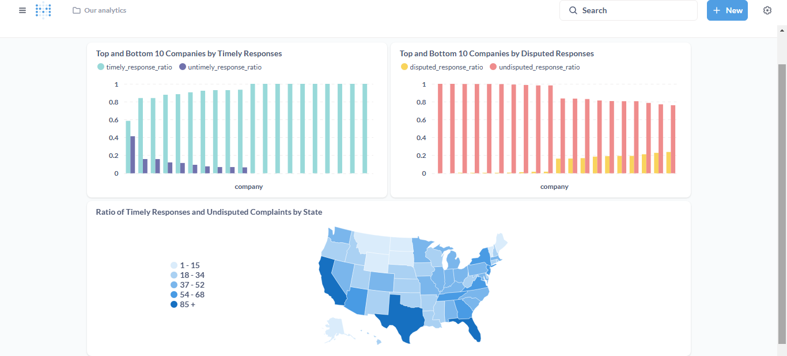

# Data-Warehouse-Pipeline

# Table of Contents

1. **[Project Objective](#project-objective)**
2. **[Datasets Selection](#datasets-selection)**
3. **[System Architecture](#system-architecture)**
   - [Data Sources](#data-sources)
   - [ETL](#etl)
   - [Storage](#storage)
   - [Visualization](#visualization)
4. **[Technologies Used](#technologies-used)**
5. **[Running the Project](#running-the-project)**
   

# Project Objective
The goal of this project is to create a data warehouse utilizing Python, Duckdb, and PostgreSQL, incorporating data on complaints against financial institutions and demographic information. used Docker for containeraization, and Metabase for visualization.

# Datasets Selection

## 1.Complain Dataset
- Source: [Complaines Dataset](https://catalog.data.gov/dataset/consumer-complaint-database)
- This dataset was provided by **data.gov** it containes 4M rows (more than 4 G) and has a csv format. it containes complaints about consumer financial products and services.

## 2.Demographic Dataset
- Source: [Demographic Dataset](https://www.kaggle.com/datasets/bitrook/us-county-historical-demographics?select=us_county_demographics.json)
- This dataset was provided by **Kaggle** (more than 2 G) it's in json format. It contains information regarding the demographics of different states.


# System Architecture

The system is divided into several components, each responsible for specific tasks:

  <center>
      
  </center>
  
### Data Sources
- We have the data files complaines.csv and geographics.json
### ETL
- Using Duckdb we convert the json file to parquet and process the data and filter it uploade it postgres table.
- Processe the csv file and uploade it to postgres tables.
### Storage
- Using postgres to store the tables and create the modleing for it.
### Visualization
using Metabase and sql to create some visualization.

# Technologies Used
- **Docker**: for contranization.
- **Duckdb**: to process the data.
- **Postgres**: as storage layer.
- **Airflow**: to orchastrate the process.
- **Metabase**: for visualization.

# Data Warehouse Architecture
The schema DataWarehouse:
  <center>
      
  </center>


## Running the Project
### 1. Clone the Project Repository
- Run the following command to clone the project repository:
   ```bash
    git clone https://github.com/FA3001/Data-Warehouse-Pipeline.git
    ```
- Navigate to the project directory:

  ```bash
  cd Data-Warehouse-Pipeline
  ```
- Create data folder
  ```bash
     makdir data
     cd data
  ```
- Download the data run the following command to **download the complaines.csv**
     ```bash
    wget https://files.consumerfinance.gov/ccdb/complaints.csv.zip
    ```
  Download the demographics.json from here **[Demographic Dataset](https://www.kaggle.com/datasets/bitrook/us-county-historical-demographics?select=us_county_demographics.json)**
**1.3. Start the Docker Containers**
  - Next, bring up all the services defined in the `docker-compose` file:

    ```bash
    docker-compose up -d
    ```
    ```bash
    cd airflow
    docker-compose up -d
    ```
    
   - This command starts all the necessary containers for the project
- **Postgres** 
- Open postgres on port 8888 like this **http://127.0.0.1/8888**
  **username and pass: admin**
- Get the host for the container
  ```bash
  docker inspect -f '{{range.NetworkSettings.Networks}}{{.IPAddress}}{{end}}' local_pgdb
  ```
- Create server and enter the connection detailes.


### Process the data
#### In the scripts folder we have 4 files:
- **postgres_manager.py**: this class is to integrate PostgreSQL so we can Connect to PostgreSQL, Upload Data.
- **complaints_eda.py**: this class is to process the complains data and upload it in chuncks to postres.
- **demographics_eda.py**: this class is to convert the json file to parquet and process the demographics data and upload it.
-  **main.py** containes the main function.
- Run the main.py using
  ```bash
     python main.py
  ```
This will excute the ETL process. open pgadmin and you will see that    we have two tables **Comlaines and Demographics**
  
After the data stored in postgres we can then start creating the tables.

### In sql folder we have:
- **creating-tables.sql: this file containes the queries for creating fact & deminsion tables along with the index on the tables, constraines and triggers, implementing SCD 2 and SCD 3**
- **inserting-data.sql: this file containes the queries for inserting the data in the tables.**
- **analysis.sql: this file containes the queries for answering some buseniss questions**
  <center>
      
  </center>

### In airflow folder:
- Open airflow ui on **http://127.0.0.1/8080**
- **dags/pipeline_dag.py**: this containes the dag for running the main function and sql files.

### Visualization 
- **Open Metabase** **http://127.0.0.1/3000**: connect to our postgres db.
- Now you can use the queries in **analysis.sql** and start creating visualization.

   <center>
      
  </center>
