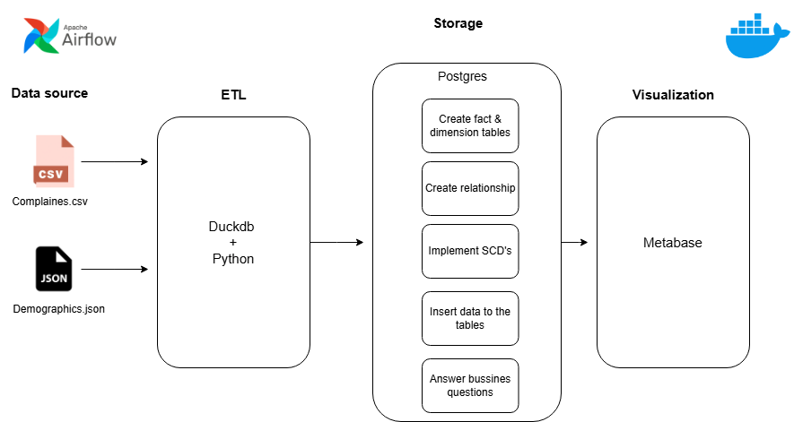
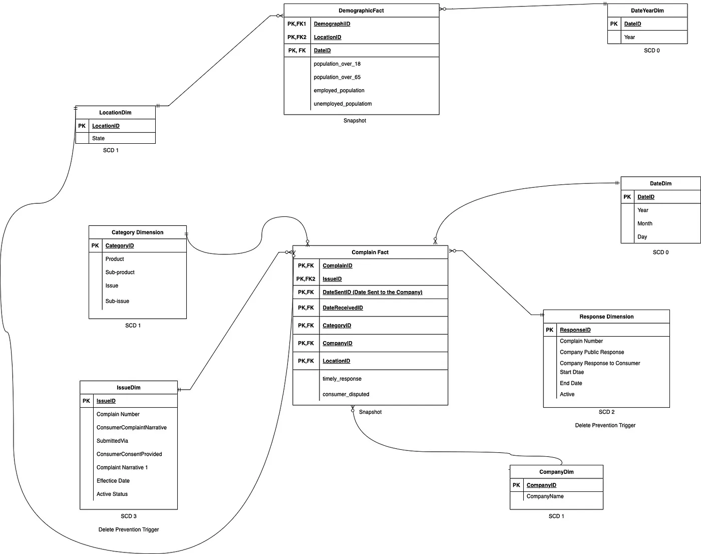

# Data-Warehouse-Pipeline

# Table of Contents

1. **[Project Objective](#project-objective)**
2. **[Datasets Selection](#datasets-selection)**
3. **[System Architecture](#system-architecture)**
   - [Data Sources](#data-sources)
   - [Data Processing Layers](#data-processing-layers)
   - [Storage Layer](#storage-layer)
   - [Analytics and Reporting](#analytics-and-reporting)
4. **[Technologies Used](#technologies-used)**
5. **[Deployment](#deployment)**
   - [System Requirements](#system-requirements)
   - [Running the Project](#running-the-project)
   - [Monitoring](#monitoring)
6. **[Results](#results)**
8. **[Future Work](#future-work)**
9. **[Authors](#authors)**

# Project Objective
The goal of this project is to create a data warehouse utilizing Python, Duckdb, and PostgreSQL, incorporating data on complaints against financial institutions and demographic information. used Docker for containeraization, and Metabase for visualization.

# Datasets Selection

## 1.Complain Dataset
- Source: [Complaines Dataset](https://catalog.data.gov/dataset/consumer-complaint-database)
- This dataset was provided by **data.gov** it containes 4M rows (more than 4 G) and has a csv format. it containes complaints about consumer financial products and services.

## 2.Demographic Dataset
- Source: [Demographic Dataset](https://www.kaggle.com/datasets/bitrook/us-county-historical-demographics?select=us_county_demographics.json)
- This dataset was provided by **Kaggle** (more than 2 G) it's in json format. It contains information regarding the demographics of different states.

# System Architecture

The system is divided into several components, each responsible for specific tasks:

  

      
  

## 1.Data Source
- We have the data files complaines.csv and geographics.json
- Using Python and Duckdb we do processing for the data 
# Data Warehouse Architecture
The schema DataWarehouse:
  

      
  

